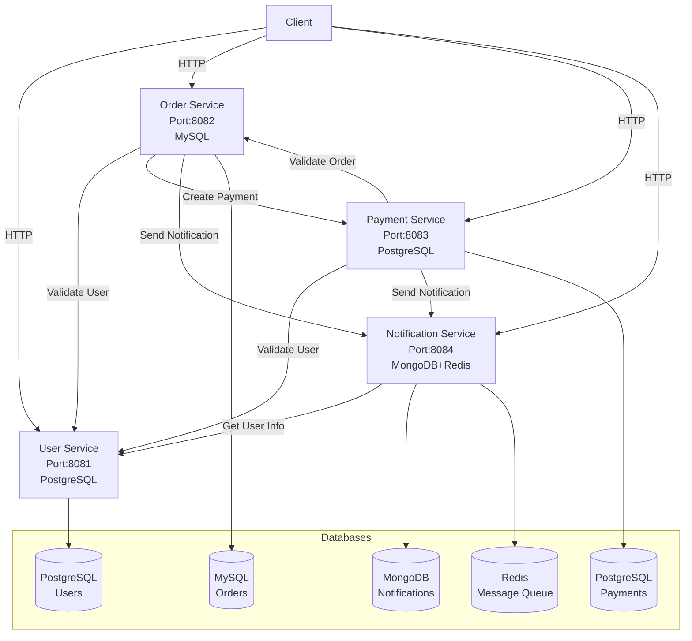
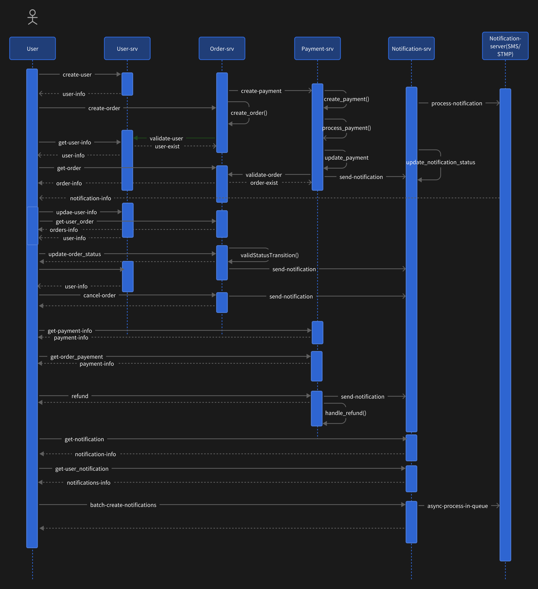

# Microservices for Contract Testing

This project demonstrates contract testing in a microservices architecture using Keploy. It includes four core services: user service, order service, payment service, and notification service.

## Architecture Overview

## Timing diagram


## API Details
### 1. User Service
- Port: 8081
- Database: PostgreSQL
- Features and APIs:

  - Create User
    ```
    POST /api/v1/users
    Content-Type: application/json
    {
        "username": "string",
        "email": "string",
        "password": "string"
    }
    ```

  - Get User Information
    ```
    GET /api/v1/users/:id
    ```

  - Update User Information
    ```
    PUT /api/v1/users/:id
    Content-Type: application/json
    {
        "username": "string",
        "email": "string"
    }
    ```

  - Delete User
    ```
    DELETE /api/v1/users/:id
    ```

#### Interaction Pattern:
This is a fundamental service providing user registration, query, update, and deletion functionalities for other microservices to interact with.

### 2. Order Service
- Port: 8082
- Database: MySQL
- Features and APIs:

  - Create Order
    ```
    POST /api/v1/orders
    Content-Type: application/json
    {
        "user_id": "uint",
        "items": [
            {
                "name": "string",
                "price": "float64",
                "quantity": "int"
            }
        ]
    }
    ```

  - Get Order Information
    ```
    GET /api/v1/orders/:id
    ```

  - Get User's Orders
    ```
    GET /api/v1/orders/user/:userId
    ```

  - Update Order Status
    ```
    PUT /api/v1/orders/:id/status
    Content-Type: application/json
    {
        "status": "string" // processing, completed, failed, cancelled
    }
    ```

  - Cancel Order
    ```
    POST /api/v1/orders/:id/cancel
    ```

#### Interaction Pattern:
The order service handles order creation and status management. It interacts with the user service to validate user information, the payment service to process order payments, and the notification service to send order status updates.

### 3. Payment Service
- Port: 8083
- Database: PostgreSQL
- Features and APIs:

  - Create Payment
    ```
    POST /api/v1/payments
    Content-Type: application/json
    {
        "order_id": "uint",
        "user_id": "uint",
        "amount": "float64",
        "payment_type": "string" // credit_card, alipay, wechat
    }
    ```

  - Get Payment Information
    ```
    GET /api/v1/payments/:id
    ```

  - Get Order Payment Information
    ```
    GET /api/v1/payments/order/:orderId
    ```

  - Get User Payment Records
    ```
    GET /api/v1/payments/user/:userId
    ```

  - Process Refund
    ```
    POST /api/v1/payments/:id/refund
    Content-Type: application/json
    {
        "reason": "string"
    }
    ```

#### Interaction Pattern:
The payment service handles order payment and refund functionalities. It interacts with the order service to validate order information, the user service to verify user information, and the notification service to send payment status notifications.

### 4. Notification Service
- Port: 8084
- Database: MongoDB + Redis
- Features and APIs:

  - Create Notification
    ```
    POST /api/v1/notifications
    Content-Type: application/json
    {
        "user_id": "uint",
        "type": "string",     // email, sms
        "title": "string",
        "content": "string",
        "recipient": "string" // email address or phone number
    }
    ```

  - Get Notification Information
    ```
    GET /api/v1/notifications/:id
    ```

  - Get User's Notifications
    ```
    GET /api/v1/notifications/user/:userId
    ```

  - Batch Create Notifications
    ```
    POST /api/v1/notifications/batch
    Content-Type: application/json
    {
        "notifications": [
            {
                "user_id": "uint",
                "type": "string",
                "title": "string",
                "content": "string",
                "recipient": "string"
            }
        ]
    }
    ```

#### Interaction Pattern:
The notification service handles all notification sending functionalities in the system. It receives notification requests from other services (order, payment, etc.), uses Redis as a message queue for asynchronous notification processing, and stores notification records in MongoDB. It supports both email and SMS notification methods.

## Getting Started

### Technology stack
- Language: Go 1.23.3
- Web framework: Gin
- Database:
  - PostgreSQL
  - MySQL
  - Redis
  - Mongo
- Containerization: Docker
- API style: RESTful
- Test framework: Keploy
- Deployment: Docker Compose

### Installation
1. Clone the repository
2. Run `docker-compose up` to start all services
3. Each service can also be run independently using their respective Dockerfiles or `go run main.go`

### Keploy Contract Testing
#### Testing
Each service includes contract tests using Keploy. To run the tests:
1. Navigate to the service directory
2. Run `go test ./...`

#### Test efficiency analysis
1. Capture dependencies between services
2. Asynchronous operation processing
3. Data storage interaction

#### Potential limitations
1. External services are difficult to simulate: such as payment gateways, notification gateways (SMTP/SMS)
2. Time-related operations are difficult to simulate and reproduce
3. Complexity of multi-service state synchronization
4. Difficult to reproduce the rollback mechanism of database operations
5. Contracts generated by keploy simulation cannot be persistently managed

## Possible optimization points
- Use gRPC for communication between microservices to improve throughput
- Use RocketMQ for message queues to improve message processing efficiency
- Use sonic tools for json processing to improve performance
- Use snowflake algorithm for ID generation to improve uniqueness
- QWQ Looking forward to your suggestions

## License
This project is licensed under the MIT License - see the LICENSE file for details
