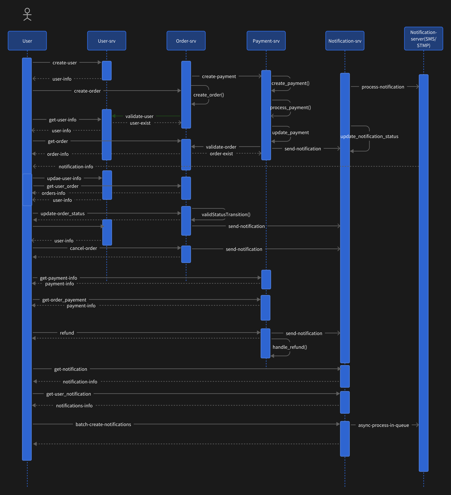

# **Microservices for Contract-Testing**
## 项目概述
这是一个基于微服务架构的电商系统，用于keploy的contract testing。系统包含用户管理、订单处理、支付处理和通知服务等核心功能，采用Go语言开发，使用Docker容器化部署，支持服务间的REST API通信。系统主要由4个微服务组成：
- user-service
- order-service
- payment-service
- notification-service
  

### 1. 用户服务 (User Service)
- 端口: 8081
- 数据库: PostgreSQL
- 功能及API:
 
   - 创建用户

      ```
      POST /api/v1/users
      Content-Type: application/json
      {
      "username": "string",
      "email": "string",
      "password": "string"
      }
      ```
  - 获取用户信息
    ```
    GET /api/v1/users/:id
    ```
  - 更新用户信息
    ```
    PUT /api/v1/users/:id
    Content-Type: application/json
    {
    "username": "string",
    "email": "string"
    }
    ```
  - 删除用户

    ```
    DELETE /api/v1/users/:id
    ```  
### 交互方式:
这是个最基本的服务,为用户提供注册、查询、更新、删除用户信息的功能，供其他微服务调用交互。


### 2. 订单服务 (Order Service)
- 端口: 8082
- 数据库: MySQL
- 功能及API:

  - 创建订单
    ```
    POST /api/v1/orders
    Content-Type: application/json
    {
        "user_id": "uint",
        "items": [
            {
                "name": "string",
                "price": "float64", 
                "quantity": "int"
            }
        ]
    }
    ```

  - 获取订单信息
    ```
    GET /api/v1/orders/:id
    ```

  - 获取用户订单列表
    ```
    GET /api/v1/orders/user/:userId
    ```

  - 更新订单状态
    ```
    PUT /api/v1/orders/:id/status
    Content-Type: application/json
    {
        "status": "string" // processing, completed, failed, cancelled
    }
    ```

  - 取消订单
    ```
    DELETE /api/v1/orders/:id
    ```

### 交互方式:
订单服务负责处理订单的创建、状态管理等功能。它会与用户服务交互验证用户信息,与支付服务交互处理订单支付,与通知服务交互发送订单状态变更通知。

### 3. 支付服务 (Payment Service)
- 端口: 8083
- 数据库: PostgreSQL
- 功能及API:

  - 创建支付
    ```
    POST /api/v1/payments
    Content-Type: application/json
    {
        "order_id": "uint",
        "user_id": "uint",
        "amount": "float64",
        "payment_type": "string" // credit_card, alipay, wechat
    }
    ```

  - 获取支付信息
    ```
    GET /api/v1/payments/:id
    ```

  - 获取订单支付信息
    ```
    GET /api/v1/payments/order/:orderId
    ```

  - 获取用户支付记录
    ```
    GET /api/v1/payments/user/:userId
    ```

  - 处理退款
    ```
    POST /api/v1/payments/:id/refund
    Content-Type: application/json
    {
        "reason": "string"
    }
    ```

### 交互方式:
支付服务负责处理订单支付和退款相关功能。它会与订单服务交互验证订单信息,与用户服务交互验证用户信息,与通知服务交互发送支付状态通知。

### 4. 通知服务 (Notification Service)
- 端口: 8084
- 数据库: MongoDB + Redis
- 功能及API:

  - 创建通知
    ```
    POST /api/v1/notifications
    Content-Type: application/json
    {
        "user_id": "uint",
        "type": "string",     // email, sms
        "title": "string",
        "content": "string",
        "recipient": "string" // email address or phone number
    }
    ```

  - 获取通知信息
    ```
    GET /api/v1/notifications/:id
    ```

  - 获取用户通知列表
    ```
    GET /api/v1/notifications/user/:userId
    ```

  - 批量创建通知
    ```
    POST /api/v1/notifications/batch
    Content-Type: application/json
    {
        "notifications": [
            {
                "user_id": "uint",
                "type": "string",
                "title": "string", 
                "content": "string",
                "recipient": "string"
            }
        ]
    }
    ```


## 时序图


## How to run:
  ```
  启动DB服务
  docker compose up -d
  ```
  ```
  分别进入srv目录，执行4个微服务
  go run main.go
  ```


## Keploy Contract Testing
  ### 测试数据


  
  ### 测试效率分析
  1. 本地服务间依赖捕获
  2. 异步操作处理
  3. 数据库存储交互模拟
  
 
  ### 潜在限制
  1. 难以同时record多个服务
  2. 时间相关操作难以模拟重现
  3. keploy模拟生成的合同无法持久化管理
  4. keploy无法模拟外部服务调用如smtp.
  5. 动态ID生成 → 响应体长度变化 → Content-Length不匹配 → 测试断言失败
  6. 时间戳时区差异 → 字符串长度波动 → 响应体字节数变化 → 头部校验失败


## 技术栈
- 语言：Go 1.23.3
- Web框架：Gin
- 数据库：
  - PostgreSQL
  - MySQL
  - Redis
  - Mongo
- 容器化：Docker
- API风格：RESTful
- 测试框架：Keploy
- 部署：Docker Compose


## Possible optimization points for microservices
- Use gRPC for communication between microservices to improve throughput
- Use RocketMQ for message queues to improve message processing efficiency
- Use sonic tools for json processing to improve performance
- Use snowflake algorithm for ID generation to improve uniqueness
- ....

